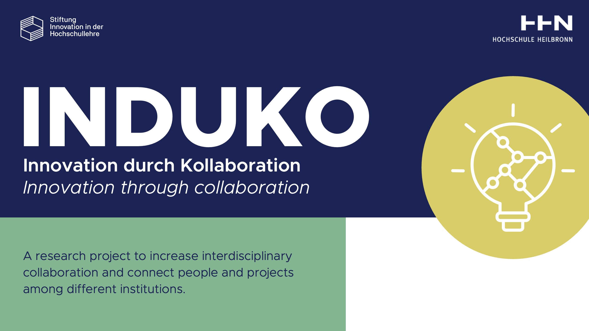

<p align="center">
  <a href="https://www.hs-heilbronn.de/de/induko" target="blank"></a>
</p>

[circleci-image]: https://img.shields.io/circleci/build/github/nestjs/nest/master?token=abc123def456
[circleci-url]: https://circleci.com/gh/nestjs/nest

  <p align="center">
  Heilbronn University is researching advanced technical tools and didactic approaches designed to foster collaboration and interaction. The primary goal is to enhance and facilitate interdisciplinary, inter-faculty, and inter-university cooperation. Through the InduKo research project, we aim to strengthen this collaboration using innovative digital tools and modern, digitally supported strategies that boost motivation and foster innovation through partnership.
A key aspect of this effort is involving students directly in the development process. The <a href="https://www.hs-heilbronn.de/en/idealize-12f73ca0754864df" target="_blank">IdeaLize</a> platform, a sub-project within InduKo, is designed to showcase HHN's ideas and projects, helping to identify collaboration opportunities, share expertise, and encourage new perspectives. Students, professors, lecturers, and staff are invited to post projects, engage in discussions, and collaborate or offer support, fostering a community of shared knowledge.
This platform facilitates sustainable project management and transparent knowledge transfer, providing a comprehensive portfolio of HHN initiatives. It inspires joint projects, potential start-ups, and a broad spectrum of exchanges across locations and faculties, empowering both students and faculty to connect and innovate together.  <a href="https://www.hs-heilbronn.de/en/projekt-induko-2cab68e84c21b797" target="_blank">InduKo</a> Project was funded by  <a href="https://stiftung-hochschullehre.de/en/" target="_blank">Stiftung Innovation in der Hochschullehre</a>(August 2021 - July 2024). 

  </p>

  <!--[](https://opencollective.com/nest#backer)
  [](https://opencollective.com/nest#sponsor)-->

## Description

Back-end service of the project is developed on `NestJS Framework`, and could be served via `Docker` and `docker-compose` on a linux server.

- Database: `MongoDB`
- Programming language: `Typescript`
- Authentication & guards : `JWT`
- Package manager: `NPM`
- Mailing system: `Mailgun`
- API Documentation: `Swagger`

#### Minimum Requirements

STEP 1 > [Download & install Node, Npm](https://nodejs.org/en/download/package-manager)

STEP 2 > [Download & install Nest](https://docs.nestjs.com/first-steps)

```
Node : 18.16.0
Npm  : 9.5.1
Nest : 9.2.0
```

## Setup
Setup the project by running below steps

STEP 1
```bash
git clone https://github.com/Mahsa-Projects/Idealize-BE-Col # fetch the project from GitHub
```

```bash
cd Idealize-BE-Col/ # go to the project's root folder
```

```bash
mkdir uploads/ # make uploads/ folder
chmod +x uploads/ # grant full access to uploads/ folder
```

```bash
cd config/ # go to config/ folder
mkdir env/ # create env folder
touch development.env # create development env file
touch production.env # create production env file
```

Now you have to add these lines into your env files based on your data

```env
PORT=3000
JWT_EXPIRES_IN=3m
JWT_REFRESH_EXPIRES_IN=10d
UPLOAD_PATH=./uploads
MONGODB_URI=Your-desire-mongo-db-path
JWT_SECRET=Your-desire-jwt-secret
JWT_ADMIN_SECRET=Your-desire-jwt-admin-secret
SWAGGER_USERNAME=Your-desire-swagger-username
SWAGGER_PASSWORD=Your-desire-swagger-password
MAILGUN_API_KEY=Your-desire-mailgun-api-key
MAILGUN_DOMAIN=Your-desire-mailgun-domain
MAILGUN_FROM=CampusConnect Your-desire-mailgun-from-header
CHAT_BOT_ENDPOINT_URL=http://127.0.0.1:8000/api/chatbot
```

STEP 2
```bash
$ npm install
```

## Running the app

```bash
# development
$ npm run start:dev

# production mode
$ npm run start:prod
```

## Support

Nest is an MIT-licensed open source project. It can grow thanks to the sponsors and support by the amazing backers. If you'd like to join them, please [read more here](https://docs.nestjs.com/support).

## Stay in touch

- Project owner & advisor - [Prof. Dr. Mahsa Fischer](https://www.hs-heilbronn.de/de/mahsa.fischer)
- Mobile Developer - [Shayan Momeni](https://github.com/shayanmomeni)
- Back-end Developer - [Sina Moradbakhti](https://github.com/sina-moradbakhti)

## License
- This project is licensed under [Apache 2.0](LICENSE). Copyright 2024 Prof. Dr. Mahsa Fischer, Hochschule Heilbronn.
- Nest is [MIT licensed](https://en.wikipedia.org/wiki/MIT_License).

## Links
- [Induko Project Website: ](https://www.hs-heilbronn.de/en/projekt-induko-2cab68e84c21b797)
- [IdeaLize Project Website: ](https://www.hs-heilbronn.de/en/idealize-12f73ca0754864df)

## Setting up and running on Server

### Requirements
- A Unix-based os server (Ubunto, CentOS)
- Install Docker on the server
- Install Git on the server
- Clone the project from [GitHub](https://github.com/Mahsa-Projects/Idealize-BE-Col)
- Go through the project folder and then,

```bash
mkdir uploads/ # make uploads/ folder
chmod +x uploads/ # grant full access to uploads/ folder
```

```bash
cd config/ # go to config/ folder
mkdir env/ # create env folder
touch development.env # create development env file
touch production.env # create production env file
```

Now you have to add these lines into your env files based on your data

```env
PORT=3000
JWT_EXPIRES_IN=3m
JWT_REFRESH_EXPIRES_IN=10d
UPLOAD_PATH=./uploads
MONGODB_URI=Your-desire-mongo-db-path
JWT_SECRET=Your-desire-jwt-secret
JWT_ADMIN_SECRET=Your-desire-jwt-admin-secret
SWAGGER_USERNAME=Your-desire-swagger-username
SWAGGER_PASSWORD=Your-desire-swagger-password
MAILGUN_API_KEY=Your-desire-mailgun-api-key
MAILGUN_DOMAIN=Your-desire-mailgun-domain
MAILGUN_FROM=CampusConnect Your-desire-mailgun-from-header
CHAT_BOT_ENDPOINT_URL=http://127.0.0.1:8000/api/chatbot
```

- At the end, run this command

```bash
docker-compose up -d
```

## Domain & Cloudflare
We highly recommend to use CloudFlare, for handling your domain (DNS server) and enable TLS and proxy mode on the panel.

#### make certificate
To enable SSL mode on your domain you have to install and use certbot on the server

```bash
sudp apt-get install certbot
```

```bash
sudo certbot certonly --standalone -d yourdomain.com
```
